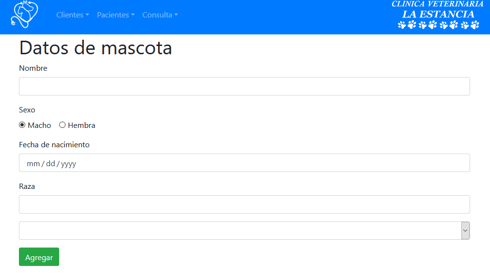

# Veterinarity

Sistema de gestión de citas y analisis clinicos para clinicas veterinarias

## Requerimentos

- Servidor web
- Navegador web
- Java 8

## Instalación

1. Clonar repositorio
2. Generar JAR mediante "./gradlew clean build"
3. Correr JAR generado mediante "java -jar veterinarity-0.0.1-SNAPSHOT.jar"

## Configuración

No se requiere de configuración extra

# Manual de uso

Para acceder a diferentes partes del sistema, utilizar el menu


## Clientes

### Agregar

1. Entrar en la pestaña "Clientes" a "Agregar".
2. Llenar datos del cliente
3. Pulsar "Agregar"


## Pacientes

### Agregar

1. Entrar en la pestaña "Pacientes" a "Agregar"
2. Llenar datos del paciente
3. Seleccionar cliente encargado de la mascota
4. Pulsar "Agregar"



## Consulta

1. Seleccionar mascota de la que se realizara la consulta


2. Llenar datos de la consulta


3. Presiontar "Agregar"

# Contribución

Pasos para contribuir al proyecto

1. Clonar repositorio

```bash
git clone https://github.com/brandontm/veterinarity.git
```

2. Hacer checkout a rama develop

```bash
git checkout develop
```

3. Crear rama de "feature" que se va a trabajar

```bash
git checkout -b "feature/{nombreFeature}"
```

4. Una vez terminado el cambio, se debe hacer pull request de develop a la rama feature en github.

5. Una vez aprobado, se genera el merge.

# Roadmap

No hay metas a desarrollar en el futuro cercano.